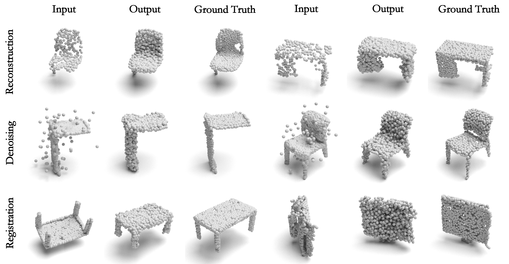

# DG-PIC: Domain Generalized Point-In-Context Learning for Point Cloud Understanding (ECCV 2024)

[Jincen Jiang*](https://www.jincenjiang.com), [Qianyu Zhou*](https://qianyuzqy.github.io/), [Yuhang Li](https://yuhang-li.com/), [Xuequan Lu+](http://xuequanlu.com/), [Meili Wang+](https://cie.nwsuaf.edu.cn/szdw/js/2012110003/index.htm), [Lizhuang Ma](https://www.cs.sjtu.edu.cn/PeopleDetail.aspx?id=86), [Jian Chang](https://staffprofiles.bournemouth.ac.uk/display/jchang), and [Jian Jun Zhang](https://jzhang.bournemouth.ac.uk/).


This is the source code for the implementation of our **[paper](https://link.springer.com/chapter/10.1007/978-3-031-72658-3_26)**.

Our benchmark is available at **[New Benchmark](https://livebournemouthac-my.sharepoint.com/:f:/g/personal/jiangj_bournemouth_ac_uk/EkFcXVw8GN1Bv2E7GehrE0sBnoibyuMfZ8Ck1Xx5FLPs_Q)**.


## Overview


The overview of our proposed **DG-PIC**. (a) Pretraining: we select an arbitrary sample from different source domains and form a query-prompt pair with the current one. The point cloud pairs will tackle the same task. Then, we mask some patches in the target point clouds randomly through the MPM framework and reconstruct them via the Transformer model. (b) Testing: we freeze the pretrained model, and generalize it towards unseen target sample through two key components: estimating source domain prototypes using *global-level* and *local-level* features, aligning target features with source domains by considering *macro-level* semantic information and *micro-level* positional relationships. We select the most similar sample from the nearest source as the prompt.


## Highlights

1. We introduce a novel and practical **multi-domain multi-task** setting in point cloud understanding and propose the DG-PIC, the **first** network to handle multiple domains and tasks within a unified model for test-time domain generalization in point cloud learning.
2. We devise two innovative **dual-level modules** for DG-PIC, *i.e.,* dual-level source prototype estimation that considers **global-level** shape and **local-level** geometry information for representing source domain, and the dual-level test-time target feature shifting that pushes the target data towards the source domain space with leveraging **macro-level** domain information and **micro-level** patch relationship information.
3. We introduce a **new benchmark** for the proposed multi-domain and multi-task setting. Comprehensive experiments show that our DG-PIC achieves **state-of-the-art** performance on three different tasks.  

## Abstract

Recent point cloud understanding research suffers from severe performance degradation on unseen data, due to the distribution shifts across different domains. While several recent studies introduce Domain Generalization (DG) techniques to mitigate this by mainly learning domain-invariant features, nearly all of them are specifically designed for a single task (*i.e.,* cannot handle multiple tasks simultaneously) and neglect the potential of testing data. Despite In-Context Learning (ICL) showcasing multi-task learning capability, it usually relies on high-quality context-rich data and considers a single dataset, and has been rarely studied in point cloud understanding. In this paper, we introduce a novel, practical setting, namely the multi-domain multi-task setting, which handles multiple domains and multiple tasks within one unified model for domain generalized point cloud understanding. To this end, we propose Domain Generalized Point-In-Context Learning (DG-PIC) that boosts the generalization ability across various tasks and domains at testing time. In particular, we develop dual-level source prototype estimation that considers both global-level shape contextual and local-level geometrical structures for representing source domains. Then, we devise a dual-level test-time feature shifting mechanism that leverages both macro-level domain semantic information and micro-level patch positional relationships to pull the target data closer to the source ones at testing time. Our DG-PIC does not require any model updates during the testing time and can handle unseen domains and multiple tasks, *i.e.,* point cloud reconstruction, denoising, and registration, within one unified model. In addition, we introduce a benchmark for this new multi-domain and multi-task setting. Comprehensive experiments demonstrate that DG-PIC outperforms state-of-the-art techniques by a large margin. 


## Implement

### 1. Requirements
Recommend version:
```
PyTorch = 2.0.0;
python = 3.10;
CUDA = 12.1;
```

Other packages:
```
pip install -r requirements.txt
```

Install "pointnet2_ops_lib":
```
cd ./pointet2_ops_lib
python setup.py install
```

Install extension for Chamfer Distance:
```
cd ./extensions/chamfer_dist
python setup.py install
```

### 2. Pretraining
To train DG-PIC on the new **multi-domain and multi-task setting**, run the following command:

```
python main.py --config cfgs/DGPIC_<target_domain>.yaml --exp_name exp/DGPIC_<target_domain>
```

Replace the `<target_domain>` by `[modelnet, shapenet, scannet, scanobjectnn]`. The remaining 3 datasets will be considered as the source domains.

### 3. Testing

To obtain the performance of the target domain on 3 different tasks through our **Test-time Domain Generalization** method, run the following command:

```
python test_dg.py --config cfgs/DGPIC_<target_domain>.yaml --exp_name DGPIC_<target_domain> --ckpts experiments/DGPIC_<target_domain>/ckpt-last.pth
```

## Visual Results




## Citation

If you find our work useful, please consider citing:

```
@inproceedings{jiang2025dg,
  title={Dg-pic: Domain generalized point-in-context learning for point cloud understanding},
  author={Jiang, Jincen and Zhou, Qianyu and Li, Yuhang and Lu, Xuequan and Wang, Meili and Ma, Lizhuang and Chang, Jian and Zhang, Jian Jun},
  booktitle={European Conference on Computer Vision},
  pages={455--474},
  year={2025},
  organization={Springer}
}
```
